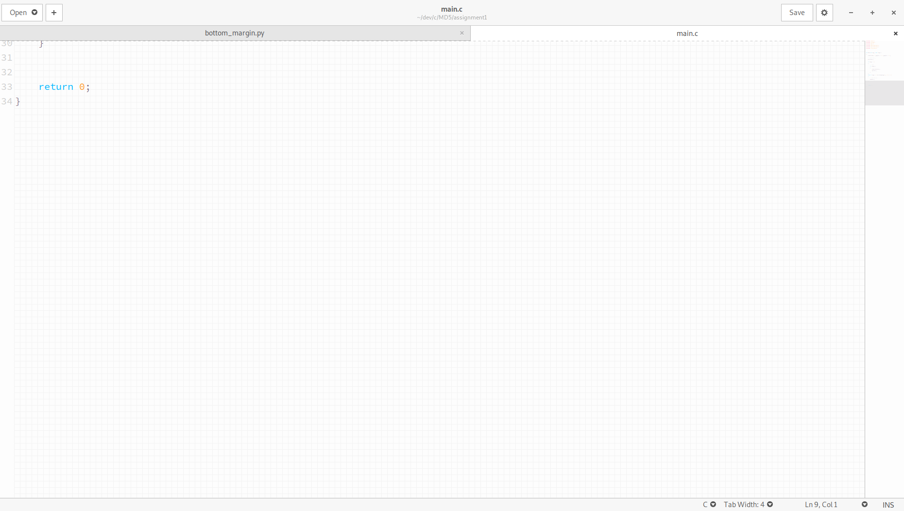

# gedit-plugin-bottom_margin
Set bottom margin (i.e. scroll past end)

## Screenshot

## Installation Instructions
- download 'bottom_margin.plugin' and 'bottom_margin.py', and move them to '~/.local/share/gedit/plugins/'
- set 'pixels' in 'bottom_margin.py'
- run gedit go to preferences -> plugins -> select Bottom Margin
